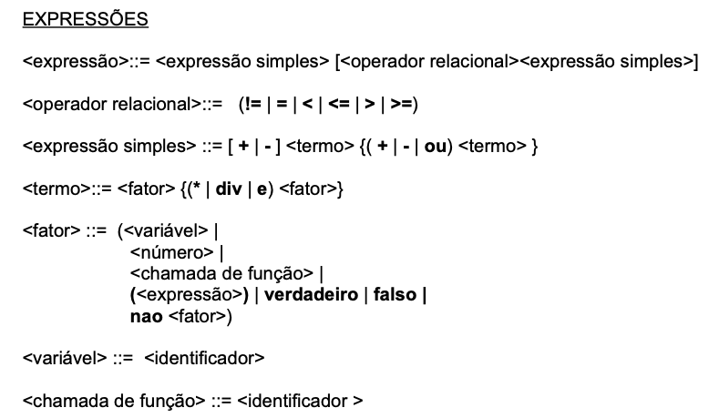

---------------
.
e sobre comentarios no nosso codigo? precisa?
----------------

atualmente esta permitindo declarar variavel com nome de proc ja definido, e proc com nome de variavel:

------------------------------------------------
x > y ou x < y

analyzeSimpleExpression:273

while (currentToken.is(Token.SMAIS) || currentToken.is(Token.SMENOS) || currentToken.is(Token.SOU) ||
currentToken.is(Token.SMAIOR) || currentToken.is(Token.SMAIORIG) || currentToken.is(Token.SIG)
|| currentToken.is(Token.SMENOR) || currentToken.is(Token.SMENORIG)
|| currentToken.is(Token.SDIF) ) {
----------------------------------------
por que nao é permitido 'verdadeiro = verdadeiro'?
programa test1;

var a,b,c: inteiro;

inicio
se verdadeiro = verdadeiro  entao
b:= 0
senao escreva(b)
fim.

{fim}