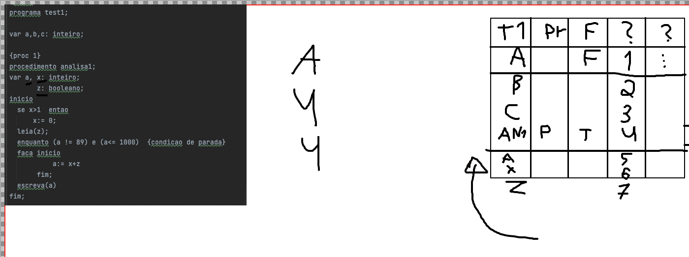
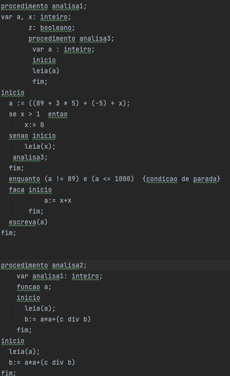

.
rotulo precisa ser LX (L1) ou é so um exemplo?
---------------
.
programa entra na tabela de simbolos... oq colocar no endereço? nada? -1? 777?
---------------
Vai dar overlap de variavel?

---------------
.
e sobre comentarios no nosso codigo? precisa?
----------------
isso nao pode 
funcao soma: inteiro;  
inicio  
....leia(soma)  
fim; 

isso pode
funcao teste: inteiro;
    funcao soma: inteiro;
    var teste;
    inicio  
    ....leia(teste)  
    fim;

pode isso arnaldo? ou precisa chamar leia(x) e atribuir a variavel soma (retorno de funcao)  
**SE PUDER, hasVarDeclaration dentro de analyzeRead precisa buscar por funcoes tambem

atualmente esta permitindo declarar variavel com nome de proc ja definido, e proc com nome de variavel:

